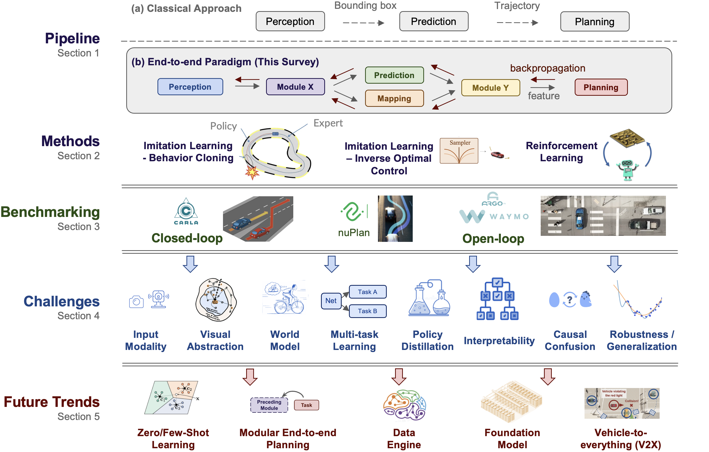

<div id="top">

# End-to-end Autonomous Driving
Frontiers and Challenges for End-to-end Autonomous Driving. 

**This repo is all you need for end-to-end autonomous driving research.** We present awesome talks, comprehensive paper collections, benchmarks, challenges, etc.


## Table of Contents

- [End-to-end Autonomous Driving](#end-to-end-autonomous-driving)
  - [Table of contents](#table-of-contents)
  - [At a Glance](#at-a-glance)
  - [Learning Materials for New Beginners](#learning-materials-for-new-beginners)
  - [Workshop and Talks](#workshop-and-talks)
  - [Paper Collection](#paper-collection)
    - [Survey](#survey)
    - [Multi-sensor Fusion](#multi-sensor-fusion)
    - [Language-guided Driving](#language-guided-driving)
    - [Multi-task Learning](#multi-task-learning)
    - [Interpretability](#interpretability)
      - [Attention Visualization](#attention-visualization)
      - [Interpretable Tasks](#interpretable-tasks)
      - [Cost Learning](#cost-learning)
      - [Linguistic Explainability](#linguistic-explainability)
      - [Uncertainty Modeling](#uncertainty-modeling)
    - [Visual Abstraction / Representation Learning](#visual-abstraction--representation-learning)
    - [Policy Distillation](#policy-distillation)
    - [Causal Confusion](#causal-confusion)
    - [World Model & Model-based RL](#world-model--model-based-rl)
    - [Robustness](#robustness)
      - [Long-tailed Distribution](#long-tailed-distribution)
      - [Covariate Shift](#covariate-shift)
      - [Domain Adaptation](#domain-adaptation)
    - [Affordance Learning](#affordance-learning)
    - [BEV](#bev)
    - [Transformer](#transformer)
    - [V2V Cooperative](#v2v-cooperative)
    - [Distributed RL](#distributed-rl)
  - [Benchmark and Dataset](#benchmark-and-dataset)
    - [Closed-loop](#closed-loop)
    - [Open-loop](#open-loop)
  - [Competition / Challenges](#competition--challenges) 
  - [Contributing](#contributing)
  - [License](#license)
  - [Citation](#citation)

## At a Glance



Instead of concentrating on individual tasks such as detection, prediction, etc., the autonomous driving community has witnessed rapid growth in approaches that embrace an end-to-end algorithm framework with raw sensor input to control signal output.  In this survey, we provide a comprehensive analysis of more than 250 papers on the motivation, roadmap, methodology, challenges, and future trends in end-to-end autonomous driving. More details can be found in the [survey paper]().

``
If you find some work popular or useful enough to be cited below, shoot us email or simply open a PR!
``

<p align="right">(<a href="#top">back to top</a>)</p>


## Learning Materials for New Beginners
- [Lecture: Self-Driving Cars](https://uni-tuebingen.de/en/fakultaeten/mathematisch-naturwissenschaftliche-fakultaet/fachbereiche/informatik/lehrstuehle/autonomous-vision/lectures/self-driving-cars/), Andreas Geiger, University of Tübingen, Germany
- [Self-Driving Cars Specialization](https://www.coursera.org/specializations/self-driving-cars), University of Toronto, Coursera
- [The Complete Self-Driving Car Course - Applied Deep Learning](https://www.udemy.com/course/applied-deep-learningtm-the-complete-self-driving-car-course/), Udemy
- [Self-Driving Car Engineer Nanodegree Program](https://www.udacity.com/course/self-driving-car-engineer-nanodegree--nd0013), Udacity

<p align="right">(<a href="#top">back to top</a>)</p>
  
## Workshop and Talks
- [CVPR 2023] [Workshop on End-to-end Autonomous Driving](https://opendrivelab.com/e2ead/cvpr23.html)
- [CVPR 2023] [End-to-End Autonomous Driving: Perception, Prediction, Planning and Simulation](https://e2ead.github.io/2023.html)
- [ICRA 2023] [Scalable Autonomous Driving](https://sites.google.com/view/icra2023av/home?authuser=0)
- [NeurIPS 2022] [Machine Learning for Autonomous Driving](https://ml4ad.github.io/)
- [IROS 2022] [Behavior-driven Autonomous Driving in Unstructured Environments](https://gamma.umd.edu/workshops/badue22/)
- [NeurIPS 2021] [Machine Learning for Autonomous Driving](https://ml4ad.github.io/2021/)
- [NeurIPS 2020] [Machine Learning for Autonomous Driving](https://ml4ad.github.io/2020/)


<details>
  <summary>Awesome Talks (IO workshops)</summary>
  
  - [Learning Robust Policies for Self-Driving](https://www.youtube.com/watch?v=rm-1sPQV4zg) - Andreas Geiger, AVVision: Autonomous Vehicle Vision Workshop, ECCV 2022
  - [AV2.0: Learning a Globally Scalable Driving Intelligence](https://www.youtube.com/watch?v=qzo61V7G1EM&t=765s) - Jamie Shotton, Fresh  Perspectives  on  the  Future  of  Autonomous  Driving Workshop, ICRA 2022
  - [End-to-End Deep Learning for Autonomous Driving](https://sites.google.com/view/cvpr20-scalability/archived-talks/keynotes?authuser=0) - Alex Kendall, Workshop on Scalability in Autonomous Driving, CVPR 2020
  - [Tesla Autopilot](https://sites.google.com/view/cvpr20-scalability/archived-talks/keynotes?authuser=0) - Andrej Karpathy, Workshop on Scalability in Autonomous Driving, CVPR 2020
  - [Autonomous Driving: The Way Forward](https://www.youtube.com/watch?v=XmtTjqimW3g) -  Vladlen Koltun, Workshop on AI for Autonomous Driving, ICML 2020
  - [Feedback in Imitation Learning: Confusion on Causality and Covariate Shift](https://www.youtube.com/watch?v=4VAwdCIBTG8) -  Sanjiban Choudhury and Arun Venkatraman, Workshop on AI for Autonomous Driving, ICML 2020
  
</details>
  
<p align="right">(<a href="#top">back to top</a>)</p>

## Paper Collection
We list key challenges from a wide span of candidate concerns, as well as trending methodologies.

### Survey

<details>
  <summary>Click me</summary>

- End-to-End Autonomous Driving: Challenges and Frontiers [[arXiv]]()

- Motion Planning for Autonomous Driving: The State of the Art and Future Perspectives [[TIV2023]](https://arxiv.org/abs/2303.09824)

- Imitation Learning: Progress, Taxonomies and Challenges [[TNNLS2022]](https://arxiv.org/abs/2106.12177)

- A Review of End-to-End Autonomous Driving in Urban Environments [[Access2022]](https://ieeexplore.ieee.org/stamp/stamp.jsp?arnumber=9832636)

- A Survey on Imitation Learning Techniques for End-to-End Autonomous Vehicles [[TITS2022]](https://arxiv.org/abs/2101.01993)

- Deep Reinforcement Learning for Autonomous Driving: A Survey [[TITS2021]](https://arxiv.org/abs/2002.00444)

- A Survey of Deep RL and IL for Autonomous Driving Policy Learning [[TITS2021]](https://arxiv.org/abs/2101.01993)

- A Survey of End-to-End Driving: Architectures and Training Methods [[TNNLS2020]](https://arxiv.org/abs/2003.06404)

- Learning to Drive by Imitation: An Overview of Deep Behavior Cloning Methods [[TIV2020]](https://ieeexplore.ieee.org/abstract/document/9117169)

- Computer Vision for Autonomous Vehicles: Problems, Datasets and State of the Art [[book]](https://arxiv.org/abs/1704.05519)

</details>

<p align="right">(<a href="#top">back to top</a>)</p>


### Multi-sensor Fusion

<details>
  <summary>Click me</summary>

- Think Twice before Driving: Towards Scalable Decoders for End-to-End Autonomous Driving [[CVPR2023]](https://arxiv.org/abs/2305.06242)[[code]](https://github.com/OpenDriveLab/ThinkTwice)

- ReasonNet: End-to-End Driving with Temporal and Global Reasoning [[CVPR2023]](https://arxiv.org/abs/2305.10507)

- Enhance Sample Efficiency and Robustness of End-to-end Urban Autonomous Driving via Semantic Masked World Model [[NeurIPSWorkshop2022]](https://arxiv.org/abs/2210.04017)

- End-to-end Autonomous Driving with Semantic Depth Cloud Mapping and Multi-agent [[IV2022]](https://arxiv.org/abs/2204.05513)

- MMFN: Multi-Modal-Fusion-Net for End-to-End Driving [[IROS2022]](https://arxiv.org/abs/2207.00186)[[code]](https://github.com/Kin-Zhang/mmfn)

- Interpretable End-to-End Urban Autonomous Driving With Latent Deep Reinforcement Learning [[TITS2022]](https://arxiv.org/abs/2001.08726)[[Code]](https://github.com/cjy1992/interp-e2e-driving.git)

- Safety-Enhanced Autonomous Driving Using Interpretable Sensor Fusion Transformer [[CoRL2022]](https://arxiv.org/abs/2207.14024)[[Code]](https://github.com/opendilab/InterFuser)

- Learning from All Vehicles [[CVPR2022]](http://arxiv.org/pdf/1709.04622v4)[[Code]](https://github.com/dotchen/LAV.git)

- TransFuser: Imitation with Transformer-Based Sensor Fusion for Autonomous Driving [[TPAMI2022]](https://arxiv.org/abs/2205.15997)[[Code]](https://github.com/autonomousvision/transfuser.git)

- Multi-Modal Fusion Transformer for End-to-End Autonomous Driving [[CVPR2021]](https://arxiv.org/abs/2104.09224)[[Code]](https://github.com/autonomousvision/transfuser.git)

- Carl-Lead: Lidar-based End-to-End Autonomous Driving with Contrastive Deep Reinforcement Learning [[arXiv2021]](https://arxiv.org/abs/2109.08473)

- Multi-modal Sensor Fusion-based Deep Neural Network for End-to-end Autonomous Driving with Scene Understanding [[IEEESJ2020]](https://arxiv.org/abs/2005.09202)
    
- Probabilistic End-to-End Vehicle Navigation in Complex Dynamic Environments With Multimodal Sensor Fusion [[RAL2020]](https://arxiv.org/abs/2005.01935)

- Multimodal End-to-End Autonomous Driving [[TITS2020]](https://ieeexplore.ieee.org/abstract/document/9165167)

- End-To-End Interpretable Neural Motion Planner [[CVPR2019]](https://openaccess.thecvf.com/content_CVPR_2019/html/Zeng_End-To-End_Interpretable_Neural_Motion_Planner_CVPR_2019_paper.html)

- Does Computer Vision Matter for Action? [[ScienceRobotics2019]](https://www.science.org/doi/abs/10.1126/scirobotics.aaw6661)

- End-To-End Multi-Modal Sensors Fusion System For Urban Automated Driving [[NeurIPSWorkshop2018]](https://openreview.net/forum?id=Byx4Xkqjcm)

- MultiNet: Multi-Modal Multi-Task Learning for Autonomous Driving [[WACV2019]](https://arxiv.org/abs/1709.05581)

- LiDAR-Video Driving Dataset: Learning Driving Policies Effectively [[CVPR2018]](https://openaccess.thecvf.com/content_cvpr_2018/html/Chen_LiDAR-Video_Driving_Dataset_CVPR_2018_paper.html)

</details>

<p align="right">(<a href="#top">back to top</a>)</p>

### Language-guided Driving

<details>
  <summary>Click me</summary>

- Ground then Navigate: Language-guided Navigation in Dynamic Scenes [[arXiv2022]](https://arxiv.org/abs/2209.11972)

- LM-Nav: Robotic Navigation with Large Pre-Trained Models of Language, Vision, and Action [[CoRL2022]](https://proceedings.mlr.press/v205/shah23b.html)

- Generating Landmark Navigation Instructions from Maps as a Graph-to-Text Problem [[ACL2021]](https://arxiv.org/abs/2012.15329)

- Advisable Learning for Self-Driving Vehicles by Internalizing Observation-to-Action Rules [[CVPR2020]](https://openaccess.thecvf.com/content_CVPR_2020/html/Kim_Advisable_Learning_for_Self-Driving_Vehicles_by_Internalizing_Observation-to-Action_Rules_CVPR_2020_paper.html)
    
- Conditional Driving from Natural Language Instructions [[CoRL2019]](https://arxiv.org/abs/1910.07615)
    
- Grounding Human-to-Vehicle Advice for Self-driving Vehicles [[CVPR2019]](https://arxiv.org/abs/1911.06978)[[Dataset]](https://usa.honda-ri.com/had)
    
- Talk to the Vehicle: Language Conditioned Autonomous Navigation of Self Driving Cars [[IROS2019]](https://ieeexplore.ieee.org/abstract/document/8967929)

- Talk2Car: Taking Control of Your Self-Driving Car [[EMNLP2019]](https://arxiv.org/abs/1909.10838)

- TOUCHDOWN: Natural Language Navigation and Spatial Reasoning in Visual Street Environments [[CVPR2019]](https://openaccess.thecvf.com/content_CVPR_2019/html/Chen_TOUCHDOWN_Natural_Language_Navigation_and_Spatial_Reasoning_in_Visual_Street_CVPR_2019_paper.html)

- Learning to Navigate in Cities Without a Map [[NeurIPS2018]](https://proceedings.neurips.cc/paper_files/paper/2018/hash/e034fb6b66aacc1d48f445ddfb08da98-Abstract.html)[[Code]](https://github.com/deepmind/streetlearn)
  
</details>

<p align="right">(<a href="#top">back to top</a>)</p>  

### Multi-task Learning

<details>
  <summary>Click me</summary>

- Planning-oriented Autonomous Driving [[CVPR2023]](https://arxiv.org/abs/2212.10156)[[Code]](https://github.com/OpenDriveLab/UniAD)

- Think Twice before Driving: Towards Scalable Decoders for End-to-End Autonomous Driving [[CVPR2023]](https://arxiv.org/abs/2305.06242)[[code]](https://github.com/OpenDriveLab/ThinkTwice)

- Coaching a Teachable Student [[CVPR2023]](https://openaccess.thecvf.com/content/CVPR2023/html/Zhang_Coaching_a_Teachable_Student_CVPR_2023_paper.html)

- ReasonNet: End-to-End Driving with Temporal and Global Reasoning [[CVPR2023]](https://arxiv.org/abs/2305.10507)

- TransFuser: Imitation with Transformer-Based Sensor Fusion for Autonomous Driving [[TPAMI2022]](https://arxiv.org/abs/2205.15997)[[Code]](https://github.com/autonomousvision/transfuser.git)
    
- Trajectory-guided Control Prediction for End-to-end Autonomous Driving: A Simple yet Strong Baseline [[NeurIPS2022]](https://arxiv.org/abs/2206.08129) [[code]](https://github.com/OpenPerceptionX/TCP)

- Safety-Enhanced Autonomous Driving Using Interpretable Sensor Fusion Transformer [[CoRL2022]](https://arxiv.org/abs/2207.14024)[[Code]](https://github.com/opendilab/InterFuser)

- Learning from All Vehicles [[CVPR2022]](http://arxiv.org/pdf/1709.04622v4)[[Code]](https://github.com/dotchen/LAV.git)

- Multi-Task Learning With Attention for End-to-End Autonomous Driving [[CVPRWorkshop2021]](https://arxiv.org/abs/2104.10753)
    
- NEAT: Neural Attention Fields for End-to-End Autonomous Driving [[ICCV2021]](https://arxiv.org/abs/2109.04456)[[Code]](https://github.com/autonomousvision/neat.git)

- SAM: Squeeze-and-Mimic Networks for Conditional Visual Driving Policy Learning [[CoRL2020]](https://arxiv.org/abs/1912.02973)[[Code]](https://github.com/twsq/sam-driving.git)

- Urban Driving with Conditional Imitation Learning [[ICRA2020]](http://arxiv.org/pdf/1912.00177v2)
   
- Multi-modal Sensor Fusion-based Deep Neural Network for End-to-end Autonomous Driving with Scene Understanding [[IEEESJ2020]](https://arxiv.org/abs/2005.09202)

- Multi-task Learning with Future States for Vision-based Autonomous Driving [[ACCV2020]](https://openaccess.thecvf.com/content/ACCV2020/papers/Kim_Multi-task_Learning_with_Future_States_for_Vision-based_Autonomous_Driving_ACCV_2020_paper.pdf)

- Learning to Steer by Mimicking Features from Heterogeneous Auxiliary Networks [[AAAI2019]](http://arxiv.org/pdf/1811.02759v1)[[Code]](https://github.com/cardwing/Codes-for-Steering-Control.git)
    
- MultiNet: Multi-Modal Multi-Task Learning for Autonomous Driving [[WACV2019]](https://arxiv.org/abs/1709.05581)
    
- Intentnet: Learning to Predict Intention from Raw Sensor Data [[CoRL2018]](https://arxiv.org/abs/2101.07907)
    
- Rethinking Self-driving: Multi-task Knowledge for Better Generalization and Accident Explanation Ability [[arXiv2018]](https://arxiv.org/abs/1809.11100)[[Code]](https://github.com/jackspp/rethinking-self-driving.git)
   
- Learning End-to-end Autonomous Driving using Guided Auxiliary Supervision [[ICVGIP2018]](https://arxiv.org/abs/1808.10393)

- End-to-end Learning of Driving Models from Large-scale Video Datasets [[CVPR2017]](https://arxiv.org/abs/1612.01079)[[Code]](https://github.com/gy20073/BDD_Driving_Model.git)

</details>

<p align="right">(<a href="#top">back to top</a>)</p>  

### Interpretability
#### Attention Visualization

<details>
  <summary>Click me</summary>

- Scaling Self-Supervised End-to-End Driving with Multi-View Attention Learning [[arxiv2023]](https://arxiv.org/abs/2302.03198)

- PlanT: Explainable Planning Transformers via Object-Level Representations [[CoRL2022]](https://arxiv.org/abs/2210.14222)[[Code]](https://github.com/autonomousvision/plant)

- MMFN: Multi-Modal-Fusion-Net for End-to-End Driving [[IROS2022]](https://arxiv.org/abs/2207.00186)[[code]](https://github.com/Kin-Zhang/mmfn)

- TransFuser: Imitation with Transformer-Based Sensor Fusion for Autonomous Driving [[TPAMI2022]](https://arxiv.org/abs/2205.15997)[[Code]](https://github.com/autonomousvision/transfuser.git)

- Multi-Modal Fusion Transformer for End-to-End Autonomous Driving [[CVPR2021]](https://arxiv.org/abs/2104.09224)[[Code]](https://github.com/autonomousvision/transfuser.git)

- Multi-Task Learning With Attention for End-to-End Autonomous Driving [[CVPRWorkshop2021]](https://arxiv.org/abs/2104.10753)

- NEAT: Neural Attention Fields for End-to-End Autonomous Driving [[ICCV2021]](https://arxiv.org/abs/2109.04456)[[Code]](https://github.com/autonomousvision/neat.git)

- Explaining Autonomous Driving by Learning End-to-End Visual Attention [[CVPRWorkshop2020]](https://openaccess.thecvf.com/content_CVPRW_2020/html/w20/Cultrera_Explaining_Autonomous_Driving_by_Learning_End-to-End_Visual_Attention_CVPRW_2020_paper.html)

- Visual Explanation by Attention Branch Network for End-to-end Learning-based Self-driving [[IV2019]](https://ieeexplore.ieee.org/abstract/document/8813900)

- Deep Object-Centric Policies for Autonomous Driving [[ICRA2019]](https://ieeexplore.ieee.org/abstract/document/8794224)

- Textual Explanations for Self-Driving Vehicles [[ECCV2018]](https://openaccess.thecvf.com/content_ECCV_2018/html/Jinkyu_Kim_Textual_Explanations_for_ECCV_2018_paper.html)[[Code]](https://github.com/JinkyuKimUCB/explainable-deep-driving)

- Learning End-to-end Autonomous Driving using Guided Auxiliary Supervision [[ICVGIP2018]](https://arxiv.org/abs/1808.10393)

- Interpretable Learning for Self-Driving Cars by Visualizing Causal Attention [[ICCV2017]](https://openaccess.thecvf.com/content_iccv_2017/html/Kim_Interpretable_Learning_for_ICCV_2017_paper.html)

</details>

<p align="right">(<a href="#top">back to top</a>)</p>
  
#### Interpretable Tasks

<details>
  <summary>Click me</summary>

- Planning-oriented Autonomous Driving [[CVPR2023]](https://arxiv.org/abs/2212.10156)[[Code]](https://github.com/OpenDriveLab/UniAD)

- Safety-Enhanced Autonomous Driving Using Interpretable Sensor Fusion Transformer [[CoRL2022]](https://arxiv.org/abs/2207.14024)[[Code]](https://github.com/opendilab/InterFuser)

- TransFuser: Imitation with Transformer-Based Sensor Fusion for Autonomous Driving [[TPAMI2022]](https://arxiv.org/abs/2205.15997)[[Code]](https://github.com/autonomousvision/transfuser.git)

- Learning from All Vehicles [[CVPR2022]](http://arxiv.org/pdf/1709.04622v4)[[Code]](https://github.com/dotchen/LAV.git)

- Ground then Navigate: Language-guided Navigation in Dynamic Scenes [[arXiv2022]](https://arxiv.org/abs/2209.11972)

- NEAT: Neural Attention Fields for End-to-End Autonomous Driving [[ICCV2021]](https://arxiv.org/abs/2109.04456)[[Code]](https://github.com/autonomousvision/neat.git)

- Multi-Task Learning With Attention for End-to-End Autonomous Driving [[CVPRWorkshop2021]](https://arxiv.org/abs/2104.10753)

- Urban Driving with Conditional Imitation Learning [[ICRA2020]](http://arxiv.org/pdf/1912.00177v2)

- Using Eye Gaze to Enhance Generalization of Imitation Networks to Unseen Environments [[TNNLS2020]](https://www.ram-lab.com/papers/2020/liu2020tnnls.pdf)

- Multi-modal Sensor Fusion-based Deep Neural Network for End-to-end Autonomous Driving with Scene Understanding [[IEEESJ2020]](https://arxiv.org/abs/2005.09202)

- Rethinking Self-driving: Multi-task Knowledge for Better Generalization and Accident Explanation Ability [[arXiv2018]](https://arxiv.org/abs/1809.11100)[[Code]](https://github.com/jackspp/rethinking-self-driving.git)

- Learning End-to-end Autonomous Driving using Guided Auxiliary Supervision [[ICVGIP2018]](https://arxiv.org/abs/1808.10393)

- End-to-end Learning of Driving Models from Large-scale Video Datasets [[CVPR2017]](https://arxiv.org/abs/1612.01079)[[Code]](https://github.com/gy20073/BDD_Driving_Model.git)

</details>

<p align="right">(<a href="#top">back to top</a>)</p>
  
#### Cost Learning

<details>
  <summary>Click me</summary>

- ST-P3: End-to-end Vision-based Autonomous Driving via Spatial-Temporal Feature Learning [[ECCV2022]](https://arxiv.org/abs/2207.07601)[[Code]](https://github.com/OpenPerceptionX/ST-P3)

- Differentiable Raycasting for Self-Supervised Occupancy Forecasting [[ECCV2022]](https://arxiv.org/abs/2210.01917)[[Code]](https://github.com/tarashakhurana/emergent-occ-forecasting.git)

- MP3: A Unified Model To Map, Perceive, Predict and Plan [[CVPR2021]](https://arxiv.org/abs/2101.06806)

- Safe Local Motion Planning With Self-Supervised Freespace Forecasting [[CVPR2021]](https://openaccess.thecvf.com/content/CVPR2021/html/Hu_Safe_Local_Motion_Planning_With_Self-Supervised_Freespace_Forecasting_CVPR_2021_paper.html)

- LookOut: Diverse Multi-Future Prediction and Planning for Self-Driving [[ICCV2021]](https://arxiv.org/abs/2101.06547)

- DSDNet: Deep Structured Self-driving Network [[ECCV2020]](https://arxiv.org/abs/2008.06041)

- Perceive, Predict, and Plan: Safe Motion Planning Through Interpretable Semantic Representations [[ECCV2020]](https://arxiv.org/abs/2008.05930)

- End-To-End Interpretable Neural Motion Planner [[CVPR2019]](https://openaccess.thecvf.com/content_CVPR_2019/html/Zeng_End-To-End_Interpretable_Neural_Motion_Planner_CVPR_2019_paper.html)

</details>

<p align="right">(<a href="#top">back to top</a>)</p>
  
#### Linguistic Explainability

<details>
  <summary>Click me</summary>

- ADAPT: Action-aware Driving Caption Transformer [[ICRA2023]](https://arxiv.org/abs/2302.00673)[[Code]](https://github.com/jxbbb/ADAPT)

- Driving Behavior Explanation with Multi-level Fusion [[PR2022]](https://www.sciencedirect.com/science/article/abs/pii/S0031320321005975)

- Explainable Object-Induced Action Decision for Autonomous Vehicles [[CVPR2020]](https://openaccess.thecvf.com/content_CVPR_2020/html/Xu_Explainable_Object-Induced_Action_Decision_for_Autonomous_Vehicles_CVPR_2020_paper.html)

- Textual Explanations for Self-Driving Vehicles [[ECCV2018]](https://openaccess.thecvf.com/content_ECCV_2018/html/Jinkyu_Kim_Textual_Explanations_for_ECCV_2018_paper.html)[[Code]](https://github.com/JinkyuKimUCB/explainable-deep-driving)

</details>

<p align="right">(<a href="#top">back to top</a>)</p>
  
#### Uncertainty Modeling

<details>
  <summary>Click me</summary>

- Probabilistic End-to-End Vehicle Navigation in Complex Dynamic Environments With Multimodal Sensor Fusion [[RAL2020]](https://arxiv.org/abs/2005.01935)

- Can Autonomous Vehicles Identify, Recover From, and Adapt to Distribution Shifts? [[ICML2020]](https://arxiv.org/abs/2006.14911)[[Code]](https://github.com/OATML/oatomobile.git)

- VTGNet: A Vision-Based Trajectory Generation Network for Autonomous Vehicles in Urban Environments [[TIV2020]](https://arxiv.org/abs/2004.12591)[[Code]](https://github.com/caipeide/VTGNet.git)

- Visual-based Autonomous Driving Deployment from a Stochastic and Uncertainty-aware Perspective [[IROS2019]](https://ieeexplore.ieee.org/abstract/document/8968307)

- Evaluating Uncertainty Quantification in End-to-End Autonomous Driving Control [[arXiv2018]](https://arxiv.org/abs/1811.06817)

</details>

<p align="right">(<a href="#top">back to top</a>)</p>
  
### Visual Abstraction / Representation Learning

<details>
  <summary>Click me</summary>

- Policy Pre-training for Autonomous Driving via Self-supervised Geometric Modeling [[ICLR2023]](https://openreview.net/forum?id=X5SUR7g2vVw)[[Code]](https://github.com/OpenDriveLab/PPGeo)

- Pre-Trained Image Encoder for Generalizable Visual Reinforcement Learning [[NeurIPS2022]](https://openreview.net/forum?id=FQtku8rkp3)

- Task-Induced Representation Learning [[ICLR2022]](https://arxiv.org/abs/2204.11827)[[Code]](https://github.com/clvrai/tarp)

- Learning Generalizable Representations for Reinforcement Learning via Adaptive Meta-learner of Behavioral Similarities [[ICLR2022]](https://arxiv.org/abs/2212.13088)[[Code]](https://github.com/jianda-chen/AMBS.git)

- Learning to Drive by Watching YouTube Videos: Action-Conditioned Contrastive Policy Pretraining [[ECCV2022]](https://arxiv.org/abs/2204.02393)[[Code]](https://github.com/metadriverse/ACO)

- Segmented Encoding for Sim2Real of RL-based End-to-End Autonomous Driving [[IV2022]](https://ieeexplore.ieee.org/abstract/document/9827374)

- GRI: General Reinforced Imitation and its Application to Vision-Based Autonomous Driving [[arXiv2021]](https://arxiv.org/abs/2111.08575)

- Latent Attention Augmentation for Robust Autonomous Driving Policies [[IROS2021]](https://ieeexplore.ieee.org/abstract/document/9636449)

- Multi-Task Long-Range Urban Driving Based on Hierarchical Planning and Reinforcement Learning [[ITSC2021]](https://ieeexplore.ieee.org/abstract/document/9564705)

- Carl-Lead: Lidar-based End-to-End Autonomous Driving with Contrastive Deep Reinforcement Learning [[arXiv2021]](https://arxiv.org/abs/2109.08473)

- A Versatile and Efficient Reinforcement Learning Framework for Autonomous Driving [[arxiv2021]](https://arxiv.org/abs/2110.11573)

- Deductive Reinforcement Learning for Visual Autonomous Urban Driving Navigation [[TNNLS2021]](https://ieeexplore.ieee.org/document/9537641)
    
- End-to-End Model-Free Reinforcement Learning for Urban Driving Using Implicit Affordances [[CVPR2020]](https://openaccess.thecvf.com/content_CVPR_2020/html/Toromanoff_End-to-End_Model-Free_Reinforcement_Learning_for_Urban_Driving_Using_Implicit_Affordances_CVPR_2020_paper.html)
    
- Toward Deep Reinforcement Learning without a Simulator: An Autonomous Steering Example [[AAAI2018]](https://ojs.aaai.org/index.php/AAAI/article/view/11490)

</details>

<p align="right">(<a href="#top">back to top</a>)</p>
  
### Policy Distillation

<details>
  <summary>Click me</summary>

- Coaching a Teachable Student [[CVPR2023]](https://openaccess.thecvf.com/content/CVPR2023/html/Zhang_Coaching_a_Teachable_Student_CVPR_2023_paper.html)

- Trajectory-guided Control Prediction for End-to-end Autonomous Driving: A Simple yet Strong Baseline [[NeurIPS2022]](https://arxiv.org/abs/2206.08129)[[code]](https://github.com/OpenPerceptionX/TCP)

- Learning from All Vehicles [[CVPR2022]](http://arxiv.org/pdf/1709.04622v4)[[Code]](https://github.com/dotchen/LAV.git)

- End-to-End Urban Driving by Imitating a Reinforcement Learning Coach [[ICCV2021]](https://arxiv.org/abs/2108.08265)[[Code]](https://github.com/zhejz/carla-roach.git)
    
- Learning To Drive From a World on Rails [[ICCV2021]](http://arxiv.org/pdf/2105.00636v3)[[Code]](https://github.com/dotchen/WorldOnRails.git)

- Learning by Cheating [[CoRL2020]](http://arxiv.org/pdf/2107.00123v1)[[Code]](https://github.com/dotchen/LearningByCheating.git)

- SAM: Squeeze-and-Mimic Networks for Conditional Visual Driving Policy Learning [[CoRL2020]](https://arxiv.org/abs/1912.02973)[[Code]](https://github.com/twsq/sam-driving.git)

- Learning to Steer by Mimicking Features from Heterogeneous Auxiliary Networks [[AAAI2019]](http://arxiv.org/pdf/1811.02759v1)[[Code]](https://github.com/cardwing/Codes-for-Steering-Control.git)

</details>

<p align="right">(<a href="#top">back to top</a>)</p>
  
### Causal Confusion

<details>
  <summary>Click me</summary>

- Fighting Fire with Fire: Avoiding DNN Shortcuts through Priming [[ICML2022]](https://arxiv.org/abs/2206.10816)

- Resolving Copycat Problems in Visual Imitation Learning via Residual Action Prediction [[ECCV2022]](https://link.springer.com/chapter/10.1007/978-3-031-19842-7_23)

- Object-Aware Regularization for Addressing Causal Confusion in Imitation Learning [[NeurIPS2021]](https://arxiv.org/abs/2110.14118)[[Code]](https://github.com/alinlab/oreo.git)

- Keyframe-Focused Visual Imitation Learning [[ICML2021]](https://arxiv.org/abs/2106.06452)[[Code]](https://github.com/AlvinWen428/keyframe-focused-imitation-learning)

- Fighting Copycat Agents in Behavioral Cloning from Observation Histories [[NeurIPS2020]](http://arxiv.org/pdf/2010.14876v1)

- Shortcut Learning in Deep Neural Networks [[NatureMachineIntelligence2020]](https://www.nature.com/articles/s42256-020-00257-z)

- Causal Confusion in Imitation Learning [[NeurIPS2019]](https://proceedings.neurips.cc/paper/2019/hash/947018640bf36a2bb609d3557a285329-Abstract.html)

- ChauffeurNet: Learning to Drive by Imitating the Best and Synthesizing the Worst [[RSS2019]](https://arxiv.org/abs/1812.03079)

- Exploring the Limitations of Behavior Cloning for Autonomous Driving [[ICCV2019]](https://arxiv.org/abs/1904.08980)[[Code]](https://github.com/felipecode/coiltraine.git)

- Off-Road Obstacle Avoidance through End-to-End Learning [[NeurIPS2005]](https://proceedings.neurips.cc/paper/2005/hash/fdf1bc5669e8ff5ba45d02fded729feb-Abstract.html)

</details>

<p align="right">(<a href="#top">back to top</a>)</p>
  
### World Model & Model-based RL

<details>
  <summary>Click me</summary>

- Model-Based Imitation Learning for Urban Driving [[NeurIPS2022)]](https://arxiv.org/abs/2210.07729)[[Code]](https://github.com/wayveai/mile.git)

- Iso-Dream: Isolating and Leveraging Noncontrollable Visual Dynamics in World Models [[NeurIPS2022]](http://arxiv.org/pdf/2205.13817v3)[[Code]](https://github.com/panmt/Iso-Dream.git)

- Enhance Sample Efficiency and Robustness of End-to-end Urban Autonomous Driving via Semantic Masked World Model [[NeurIPSWorkshop2022]](https://arxiv.org/abs/2210.04017)

- Addressing Optimism Bias in Sequence Modeling for Reinforcement Learning [[ICML2022]](https://arxiv.org/abs/2207.10295)

- Interpretable End-to-End Urban Autonomous Driving With Latent Deep Reinforcement Learning [[TITS2022]](https://arxiv.org/abs/2001.08726)[[Code]](https://github.com/cjy1992/interp-e2e-driving.git)

- Learning To Drive From a World on Rails [[ICCV2021]](http://arxiv.org/pdf/2105.00636v3)[[Code]](https://github.com/dotchen/WorldOnRails.git)

- Uncertainty-Aware Model-Based Reinforcement Learning: Methodology and Application in Autonomous Driving [[IV2022]](https://ieeexplore.ieee.org/abstract/document/9802913)

- Deductive Reinforcement Learning for Visual Autonomous Urban Driving Navigation [[TNNLS2021]](https://ieeexplore.ieee.org/document/9537641)

</details>

<p align="right">(<a href="#top">back to top</a>)</p>

### Robustness

#### Long-tailed Distribution

<details>
  <summary>Click me</summary>

- Adversarial Driving: Attacking End-to-End Autonomous Driving [[IV2023]](https://arxiv.org/abs/2103.09151)[[Code]](https://github.com/wuhanstudio/adversarial-driving.git)

- KING: Generating Safety-Critical Driving Scenarios for Robust Imitation via Kinematics Gradients [[ECCV2022]](https://arxiv.org/abs/2204.13683)[[Code]](https://github.com/autonomousvision/transfuser.git)

- AdvSim: Generating Safety-Critical Scenarios for Self-Driving Vehicles [[CVPR2021]](https://openaccess.thecvf.com/content/CVPR2021/html/Wang_AdvSim_Generating_Safety-Critical_Scenarios_for_Self-Driving_Vehicles_CVPR_2021_paper.html)

- TrafficSim: Learning To Simulate Realistic Multi-Agent Behaviors [[CVPR2021]](https://openaccess.thecvf.com/content/CVPR2021/html/Suo_TrafficSim_Learning_To_Simulate_Realistic_Multi-Agent_Behaviors_CVPR_2021_paper.html)

- Multimodal Safety-Critical Scenarios Generation for Decision-Making Algorithms Evaluation [[RAL2021]](https://arxiv.org/abs/2009.08311)

- Learning by Cheating [[CoRL2020]](http://arxiv.org/pdf/2107.00123v1)[[Code]](https://github.com/dotchen/LearningByCheating.git)

- Learning to Collide: An Adaptive Safety-Critical Scenarios Generating Method [[IROS2020]](https://arxiv.org/abs/2003.01197)

- Enhanced Transfer Learning for Autonomous Driving with Systematic Accident Simulation [[IROS2020]](https://arxiv.org/abs/2007.12148)

- Improving the Generalization of End-to-End Driving through Procedural Generation [[arXiv2020]](https://arxiv.org/abs/2012.13681)[[Code]](https://github.com/decisionforce/pgdrive.git)

- Generating Adversarial Driving Scenarios in High-Fidelity Simulators [[ICRA2019]](https://ieeexplore.ieee.org/abstract/document/8793740)

- Scalable End-to-End Autonomous Vehicle Testing via Rare-event Simulation [[NeurIPS2018]](https://proceedings.neurips.cc/paper/2018/hash/653c579e3f9ba5c03f2f2f8cf4512b39-Abstract.html)

- Microscopic Traffic Simulation using SUMO [[ITSC2018]](https://ieeexplore.ieee.org/abstract/document/8569938)

</details>

<p align="right">(<a href="#top">back to top</a>)</p>
  
#### Covariate Shift

<details>
  <summary>Click me</summary>

- Exploring Data Aggregation in Policy Learning for Vision-Based Urban Autonomous Driving [[CVPR2020]](https://openaccess.thecvf.com/content_CVPR_2020/html/Prakash_Exploring_Data_Aggregation_in_Policy_Learning_for_Vision-Based_Urban_Autonomous_CVPR_2020_paper.html)

- Learning by Cheating [[CoRL2020]](http://arxiv.org/pdf/2107.00123v1)[[Code]](https://github.com/dotchen/LearningByCheating.git)

- Agile Autonomous Driving using End-to-End Deep Imitation Learning [[RSS2018]](https://arxiv.org/abs/1709.07174)

- Query-Efficient Imitation Learning for End-to-End Simulated Driving [[AAAI2017]](https://ojs.aaai.org/index.php/AAAI/article/view/10857)

- Meta learning Framework for Automated Driving [[arXiv2017]](http://arxiv.org/pdf/1706.04038v1)

- A Reduction of Imitation Learning and Structured Prediction to No-Regret Online Learning [[AISTATS2011]](http://proceedings.mlr.press/v15/ross11a)

</details>

<p align="right">(<a href="#top">back to top</a>)</p>

<!-- - Iso-Dream: Isolating and Leveraging Noncontrollable Visual Dynamics in World Models [[NeurIPS2022]](http://arxiv.org/pdf/2205.13817v3)[[Code]](https://github.com/panmt/Iso-Dream.git)
    
- Driving Among Flatmobiles: Bird-Eye-View Occupancy Grids From a Monocular Camera for Holistic Trajectory Planning [[WACV2021]](https://arxiv.org/abs/2008.04047)
    
- Gradient-Free Adversarial Training Against Image Corruption for Learning-based Steering [[NeurIPS2021]](https://proceedings.neurips.cc/paper/2021/hash/dce8af15f064d1accb98887a21029b08-Abstract.html)

- Learning Situational Driving [[CVPR2020]](http://arxiv.org/pdf/1811.07868v2)
    
- Improving the Generalization of End-to-End Driving through Procedural Generation [[arXiv2020]](https://arxiv.org/abs/2012.13681)[[Code]](https://github.com/decisionforce/pgdrive.git)
    
- Learning Driving Models From Parallel End-to-End Driving Data Set [[ProcIEEE2020]](https://ieeexplore.ieee.org/abstract/document/8913579)

- Distributional Reinforcement Learning for Efficient Exploration [[ICML2019]](http://proceedings.mlr.press/v97/mavrin19a.html)
    
- Learning Accurate, Comfortable and Human-like Driving [[arXiv2019]](https://arxiv.org/abs/1903.10995)

- Simple Physical Adversarial Examples against End-to-End Autonomous Driving Models [[ICESS2019]](https://arxiv.org/abs/1903.05157)

- Explaining How a Deep Neural Network Trained with End-to-End Learning Steers a Car [[arXiv2017]](https://arxiv.org/abs/1704.07911)[[Code]](https://github.com/ermolenkodev/keras-salient-object-visualisation.git) -->

#### Domain Adaptation

<details>
  <summary>Click me</summary>

- Learning Interactive Driving Policies via Data-driven Simulation [[ICRA2022]](https://ieeexplore.ieee.org/abstract/document/9812407)

- Segmented Encoding for Sim2Real of RL-based End-to-End Autonomous Driving [[IV2022]](https://ieeexplore.ieee.org/abstract/document/9827374)

- Domain Adaptation In Reinforcement Learning Via Latent Unified State Representation [[AAAI2021]](https://ojs.aaai.org/index.php/AAAI/article/view/17251)[[Code]](https://github.com/KarlXing/LUSR.git)

- A Versatile and Efficient Reinforcement Learning Framework for Autonomous Driving [[arxiv2021]](https://arxiv.org/abs/2110.11573)

- Enhanced Transfer Learning for Autonomous Driving with Systematic Accident Simulation [[IROS2020]](https://arxiv.org/abs/2007.12148)

- Simulation-Based Reinforcement Learning for Real-World Autonomous Driving [[ICRA2020]](https://ieeexplore.ieee.org/abstract/document/9196730)[[Code]](https://github.com/deepsense-ai/carla-birdeye-view.git)
    
- Learning to Drive from Simulation without Real World Labels [[ICRA2019]](https://arxiv.org/abs/1812.03823)
    
- Visual-based Autonomous Driving Deployment from a Stochastic and Uncertainty-aware Perspective [[IROS2019]](https://ieeexplore.ieee.org/abstract/document/8968307)

- Virtual to Real Reinforcement Learning for Autonomous Driving [[BMVC2017]](https://arxiv.org/abs/1704.03952)[[Code]](https://github.com/SullyChen/Autopilot-TensorFlow.git)

</details>

<p align="right">(<a href="#top">back to top</a>)</p>

### Affordance Learning

<details>
  <summary>Click me</summary>

- Driver Behavioral Cloning for Route Following in Autonomous Vehicles Using Task Knowledge Distillation [[TIV2022]](https://ieeexplore.ieee.org/abstract/document/9857598)

- Policy-Based Reinforcement Learning for Training Autonomous Driving Agents in Urban Areas With Affordance Learning [[TITS2021]](https://ieeexplore.ieee.org/abstract/document/9599578)

</details>

<p align="right">(<a href="#top">back to top</a>)</p>


<!-- - Grounding Human-to-Vehicle Advice for Self-driving Vehicles [[CVPR2019]](https://arxiv.org/abs/1911.06978)[[Dataset]](https://usa.honda-ri.com/had)
       
- Model-Based Imitation Learning for Urban Driving [[NeurIPS2022)]](https://arxiv.org/abs/2210.07729)[[Code]](https://github.com/wayveai/mile.git)
    
- Approximate Inverse Reinforcement Learning from Vision-based Imitation Learning [[ICRA2021]](https://arxiv.org/pdf/2004.08051.pdf)
    
- Exploring the Limitations of Behavior Cloning for Autonomous Driving [[ICCV2019]](https://arxiv.org/abs/1904.08980)[[Code]](https://github.com/felipecode/coiltraine.git)
    
- Deep Steering: Learning End-to-End Driving Model from Spatial and Temporal Visual Cues [[arXiv2017]](https://arxiv.org/abs/1708.03798)[[Code]](https://github.com/abhileshborode/Behavorial-Clonng-Self-driving-cars.git)

- Explainability of Deep Vision-Based Autonomous Driving Systems: Review and Challenges [[IJCV2022]](https://link.springer.com/article/10.1007/s11263-022-01657-x)

- Explaining How a Deep Neural Network Trained with End-to-End Learning Steers a Car [[arXiv2017]](https://arxiv.org/abs/1704.07911)[[Code]](https://github.com/ermolenkodev/keras-salient-object-visualisation.git)

- VisualBackProp: Efficient Visualization of CNNs for Autonomous Driving [[ICRA2018]](https://ieeexplore.ieee.org/abstract/document/8461053)

- Predicting Model Failure using Saliency Maps in Autonomous Driving Systems [[ICMLWorkshop2019]](https://arxiv.org/abs/1905.07679) -->

### BEV

<details>
  <summary>Click me</summary>

- Planning-oriented Autonomous Driving [[CVPR2023]](https://arxiv.org/abs/2212.10156)[[Code]](https://github.com/OpenDriveLab/UniAD)
  
- Think Twice before Driving: Towards Scalable Decoders for End-to-End Autonomous Driving [[CVPR2023]](https://arxiv.org/abs/2305.06242)[[code]](https://github.com/OpenDriveLab/ThinkTwice)

- Coaching a Teachable Student [[CVPR2023]](https://openaccess.thecvf.com/content/CVPR2023/html/Zhang_Coaching_a_Teachable_Student_CVPR_2023_paper.html)

- ReasonNet: End-to-End Driving with Temporal and Global Reasoning [[CVPR2023]](https://arxiv.org/abs/2305.10507)

- Enhance Sample Efficiency and Robustness of End-to-end Urban Autonomous Driving via Semantic Masked World Model [[NeurIPSWorkshop2022]](https://arxiv.org/abs/2210.04017)

- Safety-Enhanced Autonomous Driving Using Interpretable Sensor Fusion Transformer [[CoRL2022]](https://arxiv.org/abs/2207.14024)[[Code]](https://github.com/opendilab/InterFuser)

- Addressing Optimism Bias in Sequence Modeling for Reinforcement Learning [[ICML2022]](https://arxiv.org/abs/2207.10295)
    
- Learning Mixture of Domain-Specific Experts via Disentangled Factors for Autonomous Driving Authors [[AAAI2022]](https://ojs.aaai.org/index.php/AAAI/article/view/20000)

- ST-P3: End-to-end Vision-based Autonomous Driving via Spatial-Temporal Feature Learning [[ECCV2022]](https://arxiv.org/abs/2207.07601)[[Code]](https://github.com/OpenPerceptionX/ST-P3)

- TransFuser: Imitation with Transformer-Based Sensor Fusion for Autonomous Driving [[TPAMI2022]](https://arxiv.org/abs/2205.15997)[[Code]](https://github.com/autonomousvision/transfuser.git)
        
- Learning from All Vehicles [[CVPR2022]](https://arxiv.org/abs/2203.11934)[[Code]](https://github.com/dotchen/LAV.git)

- Deep Federated Learning for Autonomous Driving [[IV2022]](http://arxiv.org/pdf/2110.05754v2)[[Code]](https://github.com/aioz-ai/FADNet.git)
   
- NEAT: Neural Attention Fields for End-to-End Autonomous Driving [[ICCV2021]](https://arxiv.org/abs/2109.04456)[[Code]](https://github.com/autonomousvision/neat.git)
    
- ObserveNet Control: A Vision-Dynamics Learning Approach to Predictive Control in Autonomous Vehicles [[RAL2021]](https://arxiv.org/abs/2107.08690)
    
- Lift, Splat, Shoot: Encoding Images From Arbitrary Camera Rigs by Implicitly Unprojecting to 3D [[ECCV2020]](https://arxiv.org/abs/2008.05711)[[Code]](https://github.com/nv-tlabs/lift-splat-shoot.git)

- Driving Through Ghosts: Behavioral Cloning with False Positives [[IROS2020]](https://arxiv.org/abs/2008.12969)

</details>

<p align="right">(<a href="#top">back to top</a>)</p>

### Transformer

<details>
  <summary>Click me</summary>

- Planning-oriented Autonomous Driving [[CVPR2023]](https://arxiv.org/abs/2212.10156)[[Code]](https://github.com/OpenDriveLab/UniAD)
  
- Think Twice before Driving: Towards Scalable Decoders for End-to-End Autonomous Driving [[CVPR2023]](https://arxiv.org/abs/2305.06242)[[code]](https://github.com/OpenDriveLab/ThinkTwice)

- ReasonNet: End-to-End Driving with Temporal and Global Reasoning [[CVPR2023]](https://arxiv.org/abs/2305.10507)

- Ground then Navigate: Language-guided Navigation in Dynamic Scenes [[arXiv2022]](https://arxiv.org/abs/2209.11972)

- Safety-Enhanced Autonomous Driving Using Interpretable Sensor Fusion Transformer [[CoRL2022]](https://arxiv.org/abs/2207.14024)[[Code]](https://github.com/opendilab/InterFuser)

- MMFN: Multi-Modal-Fusion-Net for End-to-End Driving [[IROS2022]](https://arxiv.org/abs/2207.00186)[[Code]](https://github.com/Kin-Zhang/mmfn.git)

- TransFuser: Imitation with Transformer-Based Sensor Fusion for Autonomous Driving [[TPAMI2022]](https://arxiv.org/abs/2205.15997)[[Code]](https://github.com/autonomousvision/transfuser.git)

- Human-AI Shared Control via Policy Dissection [[NeurIPS2022]](https://arxiv.org/abs/2206.00152)[[Code]](https://github.com/Mehooz/vision4leg.git)

- COOPERNAUT: End-to-End Driving with Cooperative Perception for Networked Vehicles [[CVPR2022]](https://arxiv.org/abs/2205.02222)[[Code]](https://github.com/UT-Austin-RPL/Coopernaut.git)

- CADRE: A Cascade Deep Reinforcement Learning Framework for Vision-Based Autonomous Urban Driving [[AAAI2022]](https://arxiv.org/abs/2202.08557)[[Code]](https://github.com/BIT-MCS/Cadre.git)

- Safe Driving via Expert Guided Policy Optimization [[CoRL2022]](http://arxiv.org/pdf/2110.06831v2)[[Code]](https://github.com/decisionforce/EGPO.git)

- NEAT: Neural Attention Fields for End-to-End Autonomous Driving [[ICCV2021]](https://arxiv.org/abs/2109.04456)[[Code]](https://github.com/autonomousvision/neat.git)

- Multi-Modal Fusion Transformer for End-to-End Autonomous Driving [[CVPR2021]](https://arxiv.org/abs/2104.09224)[[Code]](https://github.com/autonomousvision/transfuser.git)

</details>

<p align="right">(<a href="#top">back to top</a>)</p>
  
### V2V Cooperative

<details>
  <summary>Click me</summary>

- CADRE: A Cascade Deep Reinforcement Learning Framework for Vision-Based Autonomous Urban Driving [[AAAI2022]](https://arxiv.org/abs/2202.08557)[[Code]](https://github.com/BIT-MCS/Cadre.git)

- COOPERNAUT: End-to-End Driving with Cooperative Perception for Networked Vehicles [[CVPR2022]](https://arxiv.org/abs/2205.02222)[[Code]](https://github.com/UT-Austin-RPL/Coopernaut.git)

</details>

<p align="right">(<a href="#top">back to top</a>)</p>

<!-- ### federated learning
- Interpretable End-to-End Urban Autonomous Driving With Latent Deep Reinforcement Learning [[TITS2022]](https://arxiv.org/abs/2001.08726)[[Code]](https://github.com/cjy1992/interp-e2e-driving.git) -->

<!-- ### Expert Demo
- GRI: General Reinforced Imitation and its Application to Vision-Based Autonomous Driving [[arXiv2021]](https://arxiv.org/abs/2111.08575)
    
- End-to-end Autonomous Driving with Semantic Depth Cloud Mapping and Multi-agent [[IV2022]](https://arxiv.org/abs/2204.05513)

- Differentiable Control Barrier Functions for Vision-based End-to-End Autonomous Driving [[arXiv2022]](https://arxiv.org/abs/2203.02401)
    
- Generative Planning for Temporally Coordinated Exploration in Reinforcement Learning [[ICLR2022]](http://arxiv.org/pdf/2201.09765v2)[[Code]](https://github.com/Haichao-Zhang/generative-planning.git) -->

### Distributed RL

<details>
  <summary>Click me</summary>

- Safe Driving via Expert Guided Policy Optimization [[CoRL2022]](http://arxiv.org/pdf/2110.06831v2)[[Code]](https://github.com/decisionforce/EGPO.git)

- GRI: General Reinforced Imitation and its Application to Vision-Based Autonomous Driving [[arXiv2021]](https://arxiv.org/abs/2111.08575)
    
- End-to-End Model-Free Reinforcement Learning for Urban Driving Using Implicit Affordances [[CVPR2020]](https://openaccess.thecvf.com/content_CVPR_2020/html/Toromanoff_End-to-End_Model-Free_Reinforcement_Learning_for_Urban_Driving_Using_Implicit_Affordances_CVPR_2020_paper.html)
    
- Batch Policy Learning under Constraints [[ICML2019]](http://arxiv.org/pdf/1903.08738v1)[[Code]](https://github.com/gwthomas/force.git)

</details>

<p align="right">(<a href="#top">back to top</a>)</p>
  
<!-- ### IL pre-training + RL
- Safe Driving via Expert Guided Policy Optimization [[CoRL2022]](http://arxiv.org/pdf/2110.06831v2)[[Code]](https://github.com/decisionforce/EGPO.git)
  
- CIRL: Controllable Imitative Reinforcement Learning for Vision-based Self-driving  [[ECCV2018]](https://arxiv.org/abs/1807.03776)
     -->


## Benchmark and Dataset

<details>
  <summary>Click me</summary>

### Closed-loop
- [CARLA](https://carla.org/)
 - [GitHub](https://github.com/carla-simulator/carla)
- [CARLA Leaderboard](https://leaderboard.carla.org/leaderboard/)
  - [Leaderboard 1.0](https://leaderboard.carla.org/get_started_v1/)
  - [Leaderboard 2.0](https://leaderboard.carla.org/get_started/)
- [nuPlan](https://www.nuscenes.org/nuplan) ([Official Leaderboard](https://eval.ai/web/challenges/challenge-page/1856/overview) is inactive after the CVPR 2023 challege)

### Open-loop
- [nuScenes](https://www.nuscenes.org/nuscenes)
- [nuPlan](https://www.nuscenes.org/nuplan)
- [Argoverse](https://www.argoverse.org/av2.html)
- [Waymo Open Dataset](https://waymo.com/open/)

</details>
  
<p align="right">(<a href="#top">back to top</a>)</p>

## Competition / Challenges

<details>
  <summary>Click me</summary>

- [nuPlan planning](https://opendrivelab.com/AD23Challenge.html), Workshop on End-to-end Autonomous Driving, CVPR 2023
- [CARLA Autonomous Driving Challenge 2022](https://ml4ad.github.io/#challenge), Machine Learning for Autonomous Driving, NeurIPS 2022
- [CARLA Autonomous Driving Challenge 2021](https://ml4ad.github.io/2021/#challenge), Machine Learning for Autonomous Driving, NeurIPS 2021
- [CARLA Autonomous Driving Challenge 2020](https://ml4ad.github.io/2020/#challenge), Machine Learning for Autonomous Driving, NeurIPS 2020

</details>

<p align="right">(<a href="#top">back to top</a>)</p>
  
## Contributing
Thank you for all your contributions. Please make sure to read the [contributing guide](./CONTRIBUTING.md) before you make a pull request.

<p align="right">(<a href="#top">back to top</a>)</p>

## License
New Outlooks on End-to-end Autonomous Driving is released under the [MIT license](./LICENSE).

<p align="right">(<a href="#top">back to top</a>)</p>

## Citation
If you find this project useful in your research, please consider cite:
```BibTeX
@article{chen2023e2esurvey,
  title={End-to-End Autonomous Driving: Challenges and Frontiers},
  author={Chen, Li and Wu, Penghao and Chitta, Kashyap and Jaeger, Bernhard and Geiger, Andreas and Li, Hongyang},
  journal={arXiv preprint arXiv:},
  year={2023}
}
```

<p align="right">(<a href="#top">back to top</a>)</p>

## Contact
Primary contact: `lihongyang@pjlab.org.cn`. You can also contact: `lichen@pjlab.org.cn`.

Join [Slack](https://join.slack.com/t/opendrivelab/shared_invite/zt-1rcp42b35-Wc5I0MhUrahlM5qDeJrVqQ) to chat with the commuty! Slack channel: `#e2ead`.

<p align="right">(<a href="#top">back to top</a>)</p>
